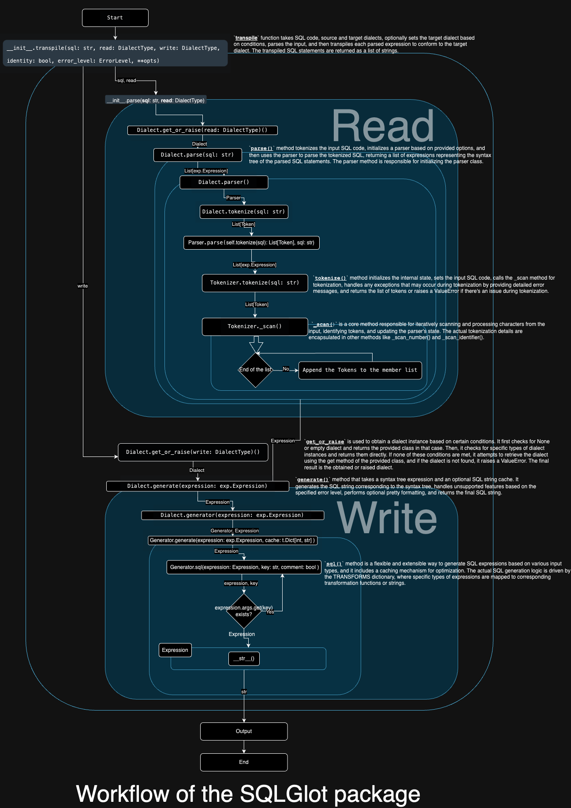

# Environments
```
python --version
Python 3.9.13
```

# Setup
Set proxy(If needed)
```shell
set https_proxy=http://pzenproxy.statestr.com:80 --trusted-host pypi.org --trusted -host files.pythonhosted.org
```
Install packages
```shell
pip install -r requirements.txt
```

# Execution
```shell
# Without params
python main.py

# Specifying a SQL filename.
python main.py dim_ssga_security.sql
```

# Notices
  - ## SQLGlot related
  - 'SORTKEY (asof_calendar_day)' might not work. > ValueError: Expected an Expression. Received <class 'list'>: [(IDENTIFIER this: asof_calendar_day, quoted: False)]
  - SQL functions are not supported.
  - Meta commands are not supported.
  - 'VIEW' statement is not supported.
  - (Patched) 'STRING' type could be converted to 'VARCHAR(*)'.
  - ## Others
  - Cases, all lower cases in actual outputs.
  - Some columns are missing.

Expected results
```SQL
CREATE TABLE IF NOT EXISTS  dim_SSGA_product
(
   SSGA_Product_Hist_Id BIGINT NOT NULL ,
   SSGA_Product_Base_Id BIGINT NOT NULL ,
   -- ~ Omitted ~
   Tracking_3rd_Party_ESG_Index    STRING ,
```

Actual output
```SQL
CREATE TABLE IF NOT EXISTS dim_ssga_security (
  ssga_security_hist_id BIGINT NOT NULL, --'ssga_' is a lower case while original is upper case 'SSGA_'
  ssga_security_base_id BIGINT NOT NULL, -- Same above
  -- ~ Omitted ~
  -- Missing > Tracking_3rd_Party_ESG_Index    STRING /*NULL ,
  -- ~ Omitted ~
```

# Documents
[Trying out the SQLGlot](docs/trying_out_sqlglot.md)

# SQLGlot Workflow

## Trace
```shell
__init__.transpile() t.List[str]
    __init__.parse(sql: str, read: DialectType) -> t.List[t.Optional[Expression]]
        Dialect.parse(sql: str) -> t.List[t.Optional[exp.Expression]]
            Dialect.tokenize(sql: str)
              Tokenizer.tokenize(sql: str) -> t.List[Token]
            Parser.parse(raw_tokens: t.List[Token], sql: t.Optional[str] = None
        ) -> t.List[t.Optional[exp.Expression]]:
    Dialect.get_or_raise(write: DialectType)() -> t.Type[Dialect]
        Dialect.generate(expression: t.Optional[exp.Expression]) -> str
        Generator.generate(...) -> str
            Generator.sql(...)
            Expression.transform(fun, *args, copy)
            Expression.replace_children(...)
```
## __init__.transpile
```python
def transpile(
    sql: str,
    read: DialectType = None,
    write: DialectType = None,
    identity: bool = True,
    error_level: t.Optional[ErrorLevel] = None,
    **opts,
) -> t.List[str]:
    """
    Parses the given SQL string in accordance with the source dialect and returns a list of SQL strings transformed
    to conform to the target dialect. Each string in the returned list represents a single transformed SQL statement.

    Args:
        sql: the SQL code string to transpile.
        read: the source dialect used to parse the input string (eg. "spark", "hive", "presto", "mysql").
        write: the target dialect into which the input should be transformed (eg. "spark", "hive", "presto", "mysql").
        identity: if set to `True` and if the target dialect is not specified the source dialect will be used as both:
            the source and the target dialect.
        error_level: the desired error level of the parser.
        **opts: other `sqlglot.generator.Generator` options.

    Returns:
        The list of transpiled SQL statements.
    """
    write = (read if write is None else write) if identity else write
    # return [
    #     Dialect.get_or_raise(write)().generate(expression, **opts)
    #     for expression in parse(sql, read, error_level=error_level)
    # ]

    #fordebug
    r = [
        Dialect.get_or_raise(write)().generate(expression, **opts)

        for expression in parse(sql, read, error_level=error_level)
    ]

    print('__init__.transpile: r: ',r) #forDebug

    return r
```

## Dialect
```python
    def tokenize(self, sql: str) -> t.List[Token]:
        print(f'Dialect.tokenize({sql}): self.tokenizer.tokenize(sql): ', self.tokenizer.tokenize(sql))  # forDebug
        return self.tokenizer.tokenize(sql)
```

## Postgres
```python
    class Tokenizer(tokens.Tokenizer):
        QUOTES = ["'", "$$"]

        BIT_STRINGS = [("b'", "'"), ("B'", "'")]
        HEX_STRINGS = [("x'", "'"), ("X'", "'")]
        BYTE_STRINGS = [("e'", "'"), ("E'", "'")]

        KEYWORDS = {
            # ~~ Omitted ~~
            "CHARACTER VARYING": TokenType.TEXT, # "CHARACTER VARYING": TokenType.VARCHAR, #forDebug
            # ~~ Omitted ~~
        }

```

## Generator.generate
```python
        self.unsupported_messages = []
        sql = self.sql(expression).strip()
        sql += '[Generator.generate()]' #forDebug
        self._cache = None
```

## Tokenizer
```python
    def __init__(
        # ~~ Omitted ~~
    ) -> None:
        """Token initializer.
            # ~~ Omitted ~~
        """
        print("Tokens.__init__(): text:",text) #forDebug
        # ~~ Omitted ~~
        
# ~~ Omitted ~~
    def tokenize(self, sql: str) -> t.List[Token]:
        # ~~ Omitted ~~
        print(f'Tokenizer.tokenize({sql}): self.tokens: ', self.tokens) # forDebug
        return self.tokens
```

## Redshift
```python
            # exp.DistKeyProperty: lambda self, e: f"DISTKEY({e.name})", # forDebug # No impact on the output
            # exp.DistStyleProperty: lambda self, e: self.naked_property(e), # forDebug # No impact on the output
```

## sql/input/sample.sql
```sql
CREATE TABLE IF NOT EXISTS my_table (
   my_int     integer not null,
   my_num       numeric(18,8),
   my_char_var           character varying(28)
)
DISTSTYLE KEY
DISTKEY (SSGA_security_exchange_base_id);
;

--CREATE VIEW my_view AS
--  SELECT my_num, my_char_var
--  FROM my_table;
```

## Output
```shell
(venv) user@MBP-2021 ssga_sqlglot% python main.py sample.sql
Tokens.__init__(): text: CREATE
Tokens.__init__(): text: TABLE
Tokens.__init__(): text: IF
Tokens.__init__(): text: NOT
Tokens.__init__(): text: EXISTS
Tokens.__init__(): text: my_table
Tokens.__init__(): text: (
Tokens.__init__(): text: my_int
Tokens.__init__(): text: integer
Tokens.__init__(): text: not
Tokens.__init__(): text: null
Tokens.__init__(): text: ,
Tokens.__init__(): text: my_num
Tokens.__init__(): text: numeric
Tokens.__init__(): text: (
Tokens.__init__(): text: 18
Tokens.__init__(): text: ,
Tokens.__init__(): text: 8
Tokens.__init__(): text: )
Tokens.__init__(): text: ,
Tokens.__init__(): text: my_char_var
Tokens.__init__(): text: CHARACTER VARYING
Tokens.__init__(): text: (
Tokens.__init__(): text: 28
Tokens.__init__(): text: )
Tokens.__init__(): text: )
Tokens.__init__(): text: DISTSTYLE
Tokens.__init__(): text: KEY
Tokens.__init__(): text: DISTKEY
Tokens.__init__(): text: (
Tokens.__init__(): text: SSGA_security_exchange_base_id
Tokens.__init__(): text: )
Tokens.__init__(): text: ;
Tokens.__init__(): text: ;
Tokenizer.tokenize(-- SELECT * FROM my_table_01;

-- SELECT * FROM my_table_02;

-- SELECT * FROM my_table_03;

CREATE TABLE IF NOT EXISTS my_table (
   my_int     integer not null,
   my_num       numeric(18,8),
   my_char_var           character varying(28)
)
DISTSTYLE KEY
DISTKEY (SSGA_security_exchange_base_id);
;

--CREATE VIEW my_view AS
--  SELECT my_num, my_char_var
--  FROM my_table;

): self.tokens:  [<Token token_type: TokenType.CREATE, text: CREATE, line: 7, col: 6, start: 93, end: 98, comments: [' SELECT * FROM my_table_01;', ' SELECT * FROM my_table_02;', ' SELECT * FROM my_table_03;']>, <Token token_type: TokenType.TABLE, text: TABLE, line: 7, col: 12, start: 100, end: 104, comments: []>, <Token token_type: TokenType.IF, text: IF, line: 7, col: 15, start: 106, end: 107, comments: []>, <Token token_type: TokenType.NOT, text: NOT, line: 7, col: 19, start: 109, end: 111, comments: []>, <Token token_type: TokenType.EXISTS, text: EXISTS, line: 7, col: 26, start: 113, end: 118, comments: []>, <Token token_type: TokenType.VAR, text: my_table, line: 7, col: 35, start: 120, end: 127, comments: []>, <Token token_type: TokenType.L_PAREN, text: (, line: 7, col: 37, start: 129, end: 129, comments: []>, <Token token_type: TokenType.VAR, text: my_int, line: 8, col: 9, start: 134, end: 139, comments: []>, <Token token_type: TokenType.INT, text: integer, line: 8, col: 21, start: 145, end: 151, comments: []>, <Token token_type: TokenType.NOT, text: not, line: 8, col: 25, start: 153, end: 155, comments: []>, <Token token_type: TokenType.NULL, text: null, line: 8, col: 30, start: 157, end: 160, comments: []>, <Token token_type: TokenType.COMMA, text: ,, line: 8, col: 31, start: 161, end: 161, comments: []>, <Token token_type: TokenType.VAR, text: my_num, line: 9, col: 9, start: 166, end: 171, comments: []>, <Token token_type: TokenType.DECIMAL, text: numeric, line: 9, col: 23, start: 179, end: 185, comments: []>, <Token token_type: TokenType.L_PAREN, text: (, line: 9, col: 24, start: 186, end: 186, comments: []>, <Token token_type: TokenType.NUMBER, text: 18, line: 9, col: 26, start: 187, end: 188, comments: []>, <Token token_type: TokenType.COMMA, text: ,, line: 9, col: 27, start: 189, end: 189, comments: []>, <Token token_type: TokenType.NUMBER, text: 8, line: 9, col: 28, start: 190, end: 190, comments: []>, <Token token_type: TokenType.R_PAREN, text: ), line: 9, col: 29, start: 191, end: 191, comments: []>, <Token token_type: TokenType.COMMA, text: ,, line: 9, col: 30, start: 192, end: 192, comments: []>, <Token token_type: TokenType.VAR, text: my_char_var, line: 10, col: 14, start: 197, end: 207, comments: []>, <Token token_type: TokenType.TEXT, text: CHARACTER VARYING, line: 10, col: 42, start: 219, end: 235, comments: []>, <Token token_type: TokenType.L_PAREN, text: (, line: 10, col: 43, start: 236, end: 236, comments: []>, <Token token_type: TokenType.NUMBER, text: 28, line: 10, col: 45, start: 237, end: 238, comments: []>, <Token token_type: TokenType.R_PAREN, text: ), line: 10, col: 46, start: 239, end: 239, comments: []>, <Token token_type: TokenType.R_PAREN, text: ), line: 11, col: 1, start: 241, end: 241, comments: []>, <Token token_type: TokenType.VAR, text: DISTSTYLE, line: 12, col: 9, start: 243, end: 251, comments: []>, <Token token_type: TokenType.VAR, text: KEY, line: 12, col: 13, start: 253, end: 255, comments: []>, <Token token_type: TokenType.VAR, text: DISTKEY, line: 13, col: 7, start: 257, end: 263, comments: []>, <Token token_type: TokenType.L_PAREN, text: (, line: 13, col: 9, start: 265, end: 265, comments: []>, <Token token_type: TokenType.VAR, text: SSGA_security_exchange_base_id, line: 13, col: 39, start: 266, end: 295, comments: []>, <Token token_type: TokenType.R_PAREN, text: ), line: 13, col: 40, start: 296, end: 296, comments: []>, <Token token_type: TokenType.SEMICOLON, text: ;, line: 13, col: 41, start: 297, end: 297, comments: []>, <Token token_type: TokenType.SEMICOLON, text: ;, line: 14, col: 1, start: 299, end: 299, comments: ['CREATE VIEW my_view AS', '  SELECT my_num, my_char_var', '  FROM my_table;']>]
Dialect.tokenize(-- SELECT * FROM my_table_01;

-- SELECT * FROM my_table_02;

-- SELECT * FROM my_table_03;

CREATE TABLE IF NOT EXISTS my_table (
   my_int     integer not null,
   my_num       numeric(18,8),
   my_char_var           character varying(28)
)
DISTSTYLE KEY
DISTKEY (SSGA_security_exchange_base_id);
;

--CREATE VIEW my_view AS
--  SELECT my_num, my_char_var
--  FROM my_table;

): self.tokenizer.tokenize(sql):  [<Token token_type: TokenType.CREATE, text: CREATE, line: 7, col: 6, start: 93, end: 98, comments: [' SELECT * FROM my_table_01;', ' SELECT * FROM my_table_02;', ' SELECT * FROM my_table_03;']>, <Token token_type: TokenType.TABLE, text: TABLE, line: 7, col: 12, start: 100, end: 104, comments: []>, <Token token_type: TokenType.IF, text: IF, line: 7, col: 15, start: 106, end: 107, comments: []>, <Token token_type: TokenType.NOT, text: NOT, line: 7, col: 19, start: 109, end: 111, comments: []>, <Token token_type: TokenType.EXISTS, text: EXISTS, line: 7, col: 26, start: 113, end: 118, comments: []>, <Token token_type: TokenType.VAR, text: my_table, line: 7, col: 35, start: 120, end: 127, comments: []>, <Token token_type: TokenType.L_PAREN, text: (, line: 7, col: 37, start: 129, end: 129, comments: []>, <Token token_type: TokenType.VAR, text: my_int, line: 8, col: 9, start: 134, end: 139, comments: []>, <Token token_type: TokenType.INT, text: integer, line: 8, col: 21, start: 145, end: 151, comments: []>, <Token token_type: TokenType.NOT, text: not, line: 8, col: 25, start: 153, end: 155, comments: []>, <Token token_type: TokenType.NULL, text: null, line: 8, col: 30, start: 157, end: 160, comments: []>, <Token token_type: TokenType.COMMA, text: ,, line: 8, col: 31, start: 161, end: 161, comments: []>, <Token token_type: TokenType.VAR, text: my_num, line: 9, col: 9, start: 166, end: 171, comments: []>, <Token token_type: TokenType.DECIMAL, text: numeric, line: 9, col: 23, start: 179, end: 185, comments: []>, <Token token_type: TokenType.L_PAREN, text: (, line: 9, col: 24, start: 186, end: 186, comments: []>, <Token token_type: TokenType.NUMBER, text: 18, line: 9, col: 26, start: 187, end: 188, comments: []>, <Token token_type: TokenType.COMMA, text: ,, line: 9, col: 27, start: 189, end: 189, comments: []>, <Token token_type: TokenType.NUMBER, text: 8, line: 9, col: 28, start: 190, end: 190, comments: []>, <Token token_type: TokenType.R_PAREN, text: ), line: 9, col: 29, start: 191, end: 191, comments: []>, <Token token_type: TokenType.COMMA, text: ,, line: 9, col: 30, start: 192, end: 192, comments: []>, <Token token_type: TokenType.VAR, text: my_char_var, line: 10, col: 14, start: 197, end: 207, comments: []>, <Token token_type: TokenType.TEXT, text: CHARACTER VARYING, line: 10, col: 42, start: 219, end: 235, comments: []>, <Token token_type: TokenType.L_PAREN, text: (, line: 10, col: 43, start: 236, end: 236, comments: []>, <Token token_type: TokenType.NUMBER, text: 28, line: 10, col: 45, start: 237, end: 238, comments: []>, <Token token_type: TokenType.R_PAREN, text: ), line: 10, col: 46, start: 239, end: 239, comments: []>, <Token token_type: TokenType.R_PAREN, text: ), line: 11, col: 1, start: 241, end: 241, comments: []>, <Token token_type: TokenType.VAR, text: DISTSTYLE, line: 12, col: 9, start: 243, end: 251, comments: []>, <Token token_type: TokenType.VAR, text: KEY, line: 12, col: 13, start: 253, end: 255, comments: []>, <Token token_type: TokenType.VAR, text: DISTKEY, line: 13, col: 7, start: 257, end: 263, comments: []>, <Token token_type: TokenType.L_PAREN, text: (, line: 13, col: 9, start: 265, end: 265, comments: []>, <Token token_type: TokenType.VAR, text: SSGA_security_exchange_base_id, line: 13, col: 39, start: 266, end: 295, comments: []>, <Token token_type: TokenType.R_PAREN, text: ), line: 13, col: 40, start: 296, end: 296, comments: []>, <Token token_type: TokenType.SEMICOLON, text: ;, line: 13, col: 41, start: 297, end: 297, comments: []>, <Token token_type: TokenType.SEMICOLON, text: ;, line: 14, col: 1, start: 299, end: 299, comments: ['CREATE VIEW my_view AS', '  SELECT my_num, my_char_var', '  FROM my_table;']>]
Tokens.__init__(): text: CREATE
Tokens.__init__(): text: TABLE
Tokens.__init__(): text: IF
Tokens.__init__(): text: NOT
Tokens.__init__(): text: EXISTS
Tokens.__init__(): text: my_table
Tokens.__init__(): text: (
Tokens.__init__(): text: my_int
Tokens.__init__(): text: integer
Tokens.__init__(): text: not
Tokens.__init__(): text: null
Tokens.__init__(): text: ,
Tokens.__init__(): text: my_num
Tokens.__init__(): text: numeric
Tokens.__init__(): text: (
Tokens.__init__(): text: 18
Tokens.__init__(): text: ,
Tokens.__init__(): text: 8
Tokens.__init__(): text: )
Tokens.__init__(): text: ,
Tokens.__init__(): text: my_char_var
Tokens.__init__(): text: CHARACTER VARYING
Tokens.__init__(): text: (
Tokens.__init__(): text: 28
Tokens.__init__(): text: )
Tokens.__init__(): text: )
Tokens.__init__(): text: DISTSTYLE
Tokens.__init__(): text: KEY
Tokens.__init__(): text: DISTKEY
Tokens.__init__(): text: (
Tokens.__init__(): text: SSGA_security_exchange_base_id
Tokens.__init__(): text: )
Tokens.__init__(): text: ;
Tokens.__init__(): text: ;
Tokenizer.tokenize(-- SELECT * FROM my_table_01;

-- SELECT * FROM my_table_02;

-- SELECT * FROM my_table_03;

CREATE TABLE IF NOT EXISTS my_table (
   my_int     integer not null,
   my_num       numeric(18,8),
   my_char_var           character varying(28)
)
DISTSTYLE KEY
DISTKEY (SSGA_security_exchange_base_id);
;

--CREATE VIEW my_view AS
--  SELECT my_num, my_char_var
--  FROM my_table;

): self.tokens:  [<Token token_type: TokenType.CREATE, text: CREATE, line: 7, col: 6, start: 93, end: 98, comments: [' SELECT * FROM my_table_01;', ' SELECT * FROM my_table_02;', ' SELECT * FROM my_table_03;']>, <Token token_type: TokenType.TABLE, text: TABLE, line: 7, col: 12, start: 100, end: 104, comments: []>, <Token token_type: TokenType.IF, text: IF, line: 7, col: 15, start: 106, end: 107, comments: []>, <Token token_type: TokenType.NOT, text: NOT, line: 7, col: 19, start: 109, end: 111, comments: []>, <Token token_type: TokenType.EXISTS, text: EXISTS, line: 7, col: 26, start: 113, end: 118, comments: []>, <Token token_type: TokenType.VAR, text: my_table, line: 7, col: 35, start: 120, end: 127, comments: []>, <Token token_type: TokenType.L_PAREN, text: (, line: 7, col: 37, start: 129, end: 129, comments: []>, <Token token_type: TokenType.VAR, text: my_int, line: 8, col: 9, start: 134, end: 139, comments: []>, <Token token_type: TokenType.INT, text: integer, line: 8, col: 21, start: 145, end: 151, comments: []>, <Token token_type: TokenType.NOT, text: not, line: 8, col: 25, start: 153, end: 155, comments: []>, <Token token_type: TokenType.NULL, text: null, line: 8, col: 30, start: 157, end: 160, comments: []>, <Token token_type: TokenType.COMMA, text: ,, line: 8, col: 31, start: 161, end: 161, comments: []>, <Token token_type: TokenType.VAR, text: my_num, line: 9, col: 9, start: 166, end: 171, comments: []>, <Token token_type: TokenType.DECIMAL, text: numeric, line: 9, col: 23, start: 179, end: 185, comments: []>, <Token token_type: TokenType.L_PAREN, text: (, line: 9, col: 24, start: 186, end: 186, comments: []>, <Token token_type: TokenType.NUMBER, text: 18, line: 9, col: 26, start: 187, end: 188, comments: []>, <Token token_type: TokenType.COMMA, text: ,, line: 9, col: 27, start: 189, end: 189, comments: []>, <Token token_type: TokenType.NUMBER, text: 8, line: 9, col: 28, start: 190, end: 190, comments: []>, <Token token_type: TokenType.R_PAREN, text: ), line: 9, col: 29, start: 191, end: 191, comments: []>, <Token token_type: TokenType.COMMA, text: ,, line: 9, col: 30, start: 192, end: 192, comments: []>, <Token token_type: TokenType.VAR, text: my_char_var, line: 10, col: 14, start: 197, end: 207, comments: []>, <Token token_type: TokenType.TEXT, text: CHARACTER VARYING, line: 10, col: 42, start: 219, end: 235, comments: []>, <Token token_type: TokenType.L_PAREN, text: (, line: 10, col: 43, start: 236, end: 236, comments: []>, <Token token_type: TokenType.NUMBER, text: 28, line: 10, col: 45, start: 237, end: 238, comments: []>, <Token token_type: TokenType.R_PAREN, text: ), line: 10, col: 46, start: 239, end: 239, comments: []>, <Token token_type: TokenType.R_PAREN, text: ), line: 11, col: 1, start: 241, end: 241, comments: []>, <Token token_type: TokenType.VAR, text: DISTSTYLE, line: 12, col: 9, start: 243, end: 251, comments: []>, <Token token_type: TokenType.VAR, text: KEY, line: 12, col: 13, start: 253, end: 255, comments: []>, <Token token_type: TokenType.VAR, text: DISTKEY, line: 13, col: 7, start: 257, end: 263, comments: []>, <Token token_type: TokenType.L_PAREN, text: (, line: 13, col: 9, start: 265, end: 265, comments: []>, <Token token_type: TokenType.VAR, text: SSGA_security_exchange_base_id, line: 13, col: 39, start: 266, end: 295, comments: []>, <Token token_type: TokenType.R_PAREN, text: ), line: 13, col: 40, start: 296, end: 296, comments: []>, <Token token_type: TokenType.SEMICOLON, text: ;, line: 13, col: 41, start: 297, end: 297, comments: []>, <Token token_type: TokenType.SEMICOLON, text: ;, line: 14, col: 1, start: 299, end: 299, comments: ['CREATE VIEW my_view AS', '  SELECT my_num, my_char_var', '  FROM my_table;']>]
Tokens.__init__(): text: varchar
Tokenizer.tokenize(varchar): self.tokens:  [<Token token_type: TokenType.VARCHAR, text: varchar, line: 1, col: 7, start: 0, end: 6, comments: []>]
Dialect.tokenize(varchar): self.tokenizer.tokenize(sql):  [<Token token_type: TokenType.VARCHAR, text: varchar, line: 1, col: 7, start: 0, end: 6, comments: []>]
Tokens.__init__(): text: varchar
Tokenizer.tokenize(varchar): self.tokens:  [<Token token_type: TokenType.VARCHAR, text: varchar, line: 1, col: 7, start: 0, end: 6, comments: []>]
Tokens.__init__(): text: varchar
Tokenizer.tokenize(varchar): self.tokens:  [<Token token_type: TokenType.VARCHAR, text: varchar, line: 1, col: 7, start: 0, end: 6, comments: []>]
Dialect.tokenize(varchar): self.tokenizer.tokenize(sql):  [<Token token_type: TokenType.VARCHAR, text: varchar, line: 1, col: 7, start: 0, end: 6, comments: []>]
Tokens.__init__(): text: varchar
Tokenizer.tokenize(varchar): self.tokens:  [<Token token_type: TokenType.VARCHAR, text: varchar, line: 1, col: 7, start: 0, end: 6, comments: []>]
Tokens.__init__(): text: varchar
Tokenizer.tokenize(varchar): self.tokens:  [<Token token_type: TokenType.VARCHAR, text: varchar, line: 1, col: 7, start: 0, end: 6, comments: []>]
Dialect.tokenize(varchar): self.tokenizer.tokenize(sql):  [<Token token_type: TokenType.VARCHAR, text: varchar, line: 1, col: 7, start: 0, end: 6, comments: []>]
Tokens.__init__(): text: varchar
Tokenizer.tokenize(varchar): self.tokens:  [<Token token_type: TokenType.VARCHAR, text: varchar, line: 1, col: 7, start: 0, end: 6, comments: []>]
Tokens.__init__(): text: float
Tokenizer.tokenize(float): self.tokens:  [<Token token_type: TokenType.FLOAT, text: float, line: 1, col: 5, start: 0, end: 4, comments: []>]
Dialect.tokenize(float): self.tokenizer.tokenize(sql):  [<Token token_type: TokenType.FLOAT, text: float, line: 1, col: 5, start: 0, end: 4, comments: []>]
Tokens.__init__(): text: float
Tokenizer.tokenize(float): self.tokens:  [<Token token_type: TokenType.FLOAT, text: float, line: 1, col: 5, start: 0, end: 4, comments: []>]
Tokens.__init__(): text: float
Tokenizer.tokenize(float): self.tokens:  [<Token token_type: TokenType.FLOAT, text: float, line: 1, col: 5, start: 0, end: 4, comments: []>]
Dialect.tokenize(float): self.tokenizer.tokenize(sql):  [<Token token_type: TokenType.FLOAT, text: float, line: 1, col: 5, start: 0, end: 4, comments: []>]
Tokens.__init__(): text: float
Tokenizer.tokenize(float): self.tokens:  [<Token token_type: TokenType.FLOAT, text: float, line: 1, col: 5, start: 0, end: 4, comments: []>]
Tokens.__init__(): text: float
Tokenizer.tokenize(float): self.tokens:  [<Token token_type: TokenType.FLOAT, text: float, line: 1, col: 5, start: 0, end: 4, comments: []>]
Dialect.tokenize(float): self.tokenizer.tokenize(sql):  [<Token token_type: TokenType.FLOAT, text: float, line: 1, col: 5, start: 0, end: 4, comments: []>]
Tokens.__init__(): text: float
Tokenizer.tokenize(float): self.tokens:  [<Token token_type: TokenType.FLOAT, text: float, line: 1, col: 5, start: 0, end: 4, comments: []>]
__init__.transpile: r:  ['CREATE TABLE IF NOT EXISTS my_table (\n  my_int INT NOT NULL,\n  my_num DECIMAL(18, 8),\n  my_char_var STRING(28)\n)\nDISTSTYLE=KEY\nDISTKEY=SSGA_security_exchange_base_id[Generator.generate()]', '[Generator.generate()]']
CREATE TABLE IF NOT EXISTS my_table (
  my_int INT NOT NULL,
  my_num DECIMAL(18, 8),
  my_char_var STRING(28)
)
  USING DELTA
  TBLPROPERTIES('DELTA.FEATURE.ALLOWCOLUMNDEFAULTS' = 'SUPPORTED','delta.isolationLevel' = 'Serializable','delta.feature.timestampNtz' = 'supported');
  
  ALTER TABLE my_table ALTER COLUMN Effective_Timestamp DROP DEFAULT;
  ALTER TABLE my_table" ALTER COLUMN Effective_Timestamp SET DEFAULT (TO_UTC_TIMESTAMP(CURRENT_TIMESTAMP(), CURRENT_TIMEZONE()));
            ;

[Generator.generate()]

```